# SnapQuest 유저플로우 v2 — 파티 포토 빙고 & 네컷 전리품 (2026-08-29)

```mermaid
flowchart LR
    subgraph s6["6. 호스트 진행 도구"]
        h1["호스트: 방 생성"] --> h2["TV에 QR·방코드 표시"]
        h1 --> h3["AI 미션 프리셋 생성·수정"]
        h1 --> h6["현장 리워드 토글 - 기본 꺼짐"]
        h1 --> h8["참가·미션 통계 대시보드 🟢"]
        h4["네컷 타임 트리거 🟡"]
        h5["콘텐츠 숨김 버튼"]
        h9["시상 시작 트리거"]
        h7["파티 종료 처리"]
        h6 -- "켠 경우" --> h10["게스트 화면에 리워드 안내 표시"]
    end

    subgraph s1["1. 입장 & AI 캐릭터"]
        a1["게스트: QR·방코드·URL 입장 - 설치·로그인 없음"] --> a8{"기존 세션 토큰 있음?"}
        a8 -- "예" --> a9["세션 복원 - 재접속 재동기화"]
        a8 -- "아니오" --> a2["닉네임 + 셀카 1장 또는 자기소개 3줄"]
        a2 --> a3["AI 캐릭터 일러스트 생성 시작 - 비차단"]
        a3 --> a4{"캐릭터 생성 성공?"}
        a4 -- "성공" --> a5["TV 로비에 캐릭터 등장 + LLM 사회자 소개 멘트"]
        a4 -- "실패·타임아웃" --> a6["프리셋 아바타 자동 폴백"]
        a6 --> a5
        a7["봇 참가자 자동 입장·활동 - 데모 방"] --> a5
    end

    subgraph s2["2. 개인화 빙고 & 미션 인증"]
        b1["AI가 각자 다른 3×3 사진 미션 빙고판 생성 - 동의 기반 함께 찍기"] --> b2["빙고 칸 선택"]
        b2 --> b3["촬영 또는 업로드"]
        b3 --> b4{"AI 비전 자동 판정"}
        b4 -- "통과" --> b5["자동 한 줄 캡션 생성 - 수정은 선택"]
        b4 -- "불확실·실패" --> b6{"수동 인증 셀프 체크 통과?"}
        b6 -- "예" --> b5
        b6 -- "아니오" --> b2
        b5 --> b7["빙고 칸 채움 + 진행률 갱신"]
        b7 --> b2
        b8["하단 카메라 버튼 상시 노출"] --> b9["자유 사진: 찍은 사람 갤러리 자동 귀속 - 얼굴인식 없음"]
    end

    subgraph s3["3. 라이브 포토월 & 네컷 타임"]
        c0{"표시할 인증 콘텐츠 있음?"}
        c0 -- "예" --> c1["TV 라이브 포토월 렌더 + 사회자 리액션 멘트"]
        c0 -- "아니오" --> c3["시드·봇 콘텐츠 표시 - 빈 화면 방지"]
        c3 --> c1
        c1 -- "포토월에서 제거" --> c4["해당 사진 즉시 숨김 - 초상권 보호"]
        c5["TV 카운트다운 + 컷마다 포즈 미션 동기 셀피 4컷 🟡"] --> c6["랜덤 4명 합동 네컷 완성 🟡"]
        c6 --> c1
    end

    subgraph s4["4. 칭호 & 엔딩 네컷 티켓"]
        d2["칭호 배치 1회 생성 + 베스트샷 참가자 투표 시상"]
        d1["엔딩 콘텐츠 오픈"] --> d3["빙고·자유 사진 중 4장 선택 또는 AI 추천 - 부족분은 캐릭터·칭호 카드"]
        d2 -- "칭호는 티켓 재료" --> d3
        d3 --> dF{"프레임 선택"}
        dF -- "기본 3종 무료" --> d4["캔버스 합성: 개인화 네컷 티켓 + 단체 프레임 1장"]
        dF -- "추가 프레임" --> d6{"빙고 1줄 달성?"}
        d6 -- "예" --> d8["추가 프레임 해금"]
        d6 -- "아니오" --> d7{"내 초대 링크로 신규 1명 입장?"}
        d7 -- "예" --> d8
        d7 -- "아니오" --> d9["잠김 유지 - 기본 프레임으로 진행 가능"]
        d9 --> dF
        d8 --> d4
        d4 --> d11{"캔버스 합성 성공?"}
        d11 -- "예" --> d10["이미지 꾹 눌러 저장 + 공유 시트"]
        d11 -- "아니오" --> d12["플레이스홀더 티켓 폴백"]
        d12 --> d10
    end

    subgraph s5["5. 공동 앨범 & 보관"]
        e1["방 링크 = 공동 롤필름 앨범 + 내 티켓 보관함"] --> e2["무료 7일 보관"]
        e2 --> e3["만료 3일 전 알림 - 리텐션 트리거"]
        e3 --> e4{"알림 클릭?"}
        e4 -- "예" --> e5["앨범 재방문 - 링크 재방문만으로 접근, 로그인 없음"]
        e5 --> e1
        e4 -- "아니오" --> e6["7일 경과 시 만료"]
    end

    h2 --> a1
    h3 --> b1
    h4 --> c5
    h5 -- "숨김 실행" --> c4
    h9 --> d2
    d2 -- "시상 완료 후" --> h7
    h7 -- "종료 처리" --> d1
    a9 --> b1
    a2 -- "비차단: 생성 대기 없이 진행" --> b1
    b7 -. "실시간 반영" .-> c0
    b9 -. "실시간 반영" .-> c0
    a7 -. "실시간 반영" .-> c3
    a7 -. "봇 미션 인증" .-> b7
    b7 -- "종료 후 티켓 후보로 포함" --> d3
    b9 -- "종료 후 티켓 후보로 포함" --> d3
    d9 -- "초대 링크 전송 - 경유 입장 시 invited_by 기록, 해금·K 측정 근거" --> a1
    a1 -. "invited_by 검증" .-> d8
    c4 -. "앨범에서도 비노출" .-> e1
    d10 --> e1
```

## 범례

- **마름모 분기**: 모든 분기 엣지에 라벨(예/아니오 또는 구체 조건) 표기.
- **점선(`-.실시간 반영.->`)**: Supabase Realtime 기반 실시간 데이터 반영(인증 사진·봇 활동 → 포토월). 그 외 점선: 봇 미션 인증(a7→b7, 판·포토월 활성), 초대 입장 invited_by 검증(a1→d8 해금 귀환), 숨김 처리분 앨범 비노출(c4→e1).
- **시상→종료 순서**: h9(시상 시작 트리거) → d2(칭호·베스트샷 시상) → h7(종료 처리) → d1(엔딩 오픈) → d3(4장 선택) — PRD F6(파티 말미 시상)·F9(종료 처리)·§5 데모 시나리오 순서와 일치. b7·b9 → d3 실선은 파티 중 소재가 종료 후 티켓 후보로 넘어가는 데이터 흐름(즉시 전환 아님).
- **🟡**: 2일차 여력 시 구현(F5 네컷 타임). **🟢**: P2 낮음(F9 통계 대시보드). 표기 없는 노드는 🔴 코어.
- **폴백 경로**: 캐릭터 생성 실패→프리셋 아바타(a6), AI 비전 불확실→수동 셀프 체크(b6), 콘텐츠 없음→시드·봇(c3), 캔버스 합성 실패→플레이스홀더 티켓(d12), 재접속→세션 복원(a9).
- **확산 루프**: d9→a1 초대 링크(invited_by 기록) → a1→d8 검증 귀환으로 해금 성립 = K-팩터 측정 근거. 티켓 저장(d10)은 반드시 공동 앨범(e1)으로 귀결 — dead-end 없음.
